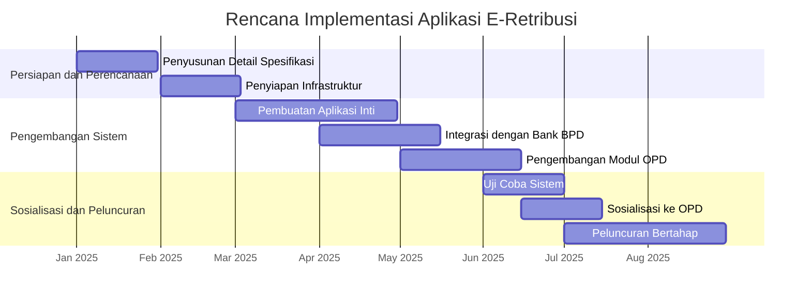

Berdasarkan penelitian terhadap kebutuhan Kota Baubau, berikut disusun proposal aplikasi E-Retribusi terintegrasi untuk meningkatkan Pendapatan Asli Daerah (PAD) dan mendukung terwujudnya Smart City.

# Proposal Aplikasi E-Retribusi Kota Baubau: Solusi Terintegrasi untuk Optimalisasi Penerimaan Daerah

## 1 Latar Belakang

Pengelolaan retribusi daerah di Kota Baubau selama ini menghadapi berbagai tantangan, antara lain **sistem pemungutan manual** yang berpotensi menyebabkan **data hilang atau sulit ditemukan**, serta kurangnya **transparansi dan efisiensi** dalam proses pencatatan dan pelaporan . Di sisi lain, Pemerintah Kota Baubau telah menerbitkan **Peraturan Daerah (Perda) Nomor 1 Tahun 2024** tentang Pajak Daerah dan Retribusi Daerah yang menjadi landasan hukum kuat untuk melakukan transformasi digital dalam pengelolaan pendapatan daerah . Peraturan yang mulai berlaku pada 22 Januari 2024 ini memerlukan implementasi teknis yang efektif untuk mencapai tujuannya.

Digitalisasi retribusi daerah tidak hanya sekadar mengubah sistem dari manual ke digital, tetapi merupakan **transformasi mendasar** dalam tata kelola keuangan daerah. Implementasi aplikasi E-Retribusi akan mengoptimalkan penerimaan retribusi, **mengurangi potensi kebocoran keuangan**, serta meningkatkan akuntabilitas dan transparansi pengelolaan keuangan daerah . Sistem ini juga sejalan dengan visi Kota Baubau menuju **Smart City** yang memanfaatkan teknologi digital untuk meningkatkan kualitas pelayanan publik.

## 2 Landasan Hukum

- **Peraturan Daerah Kota Baubau Nomor 1 Tahun 2024** tentang Pajak Daerah dan Retribusi Daerah
- **Peraturan Bupati/Wali Kota** terkait pengelolaan retribusi daerah
- **Peraturan Bank Indonesia** mengenai pembayaran digital
- **Peraturan Pemerintah** tentang Pengelolaan Keuangan Daerah

## 3 Tujuan dan Manfaat

### 3.1 Tujuan

- Membangun **sistem terintegrasi** untuk pengelolaan retribusi daerah di Kota Baubau
- **Meningkatkan kepatuhan wajib retribusi** melalui kemudahan pembayaran
- **Mengoptimalkan penerimaan retribusi** daerah secara efektif dan efisien
- Menciptakan **sistem yang transparan dan akuntabel** dalam pengelolaan retribusi

### 3.2 Manfaat

- **Bagi Pemerintah Daerah**: Meningkatkan **Pendapatan Asli Daerah (PAD)**, mengurangi kebocoran penerimaan, dan menyediakan data real-time untuk monitoring dan evaluasi
- **Bagi Masyarakat dan Pelaku Usaha**: Memberikan **kemudahan pembayaran** retribusi melalui berbagai channel pembayaran, menghemat waktu, dan meningkatkan transparansi jumlah yang harus dibayar
- **Bagi Stakeholder Lainnya**: Membangun **ekosistem digital** yang terintegrasi antara pemerintah, bank, dan masyarakat

## 4 Ruang Lingkup Aplikasi

Aplikasi E-Retribusi Kota Baubau akan mengintegrasikan berbagai jenis retribusi dari seluruh Organisasi Perangkat Daerah (OPD) terkait. Berikut adalah rincian cakupan aplikasi:

| OPD Penanggung Jawab  | Jenis Retribusi                                    | Deskripsi Pelayanan                                                               |
| :-------------------- | :------------------------------------------------- | :-------------------------------------------------------------------------------- |
| **DPMPTSP**     | Retribusi IMB/PBG dan Reklame                      | Pembayaran retribusi terkait perizinan konstruksi dan penggunaan reklame          |
| **Disparekraf** | Retribusi Tempat Rekreasi dan Olahraga             | Pembayaran retribusi tempat wisata, pusat kebugaran, dan fasilitas olahraga       |
| **Dishub**      | Retribusi Parkir, Jasa Kepelabuhanan, dan Terminal | Pembayaran retribusi parkir kendaraan, pelayanan kapal di pelabuhan, dan terminal |
| **PDAM**        | Retribusi PDAM                                     | Pembayaran tagihan air minum secara terintegrasi                                  |
| **Disperindag** | Retribusi Pelayanan Pasar (Los, Kios)              | Pembayaran sewa los dan kios di pasar tradisional secara digital                  |
| **Dinas PUPR**  | Retribusi IMB/PBG dan Sewa Alat Berat              | Pembayaran retribusi perizinan konstruksi dan sewa alat berat                     |
| **DLH**         | Retribusi Pelayanan Persampahan/Kebersihan         | Pembayaran retribusi pelayanan kebersihan dan pengelolaan sampah                  |

## 5 Struktur Organisasi dan Koordinasi

Implementasi aplikasi E-Retribusi Kota Baubau melibatkan koordinasi multiple stakeholder dengan pembagian peran sebagai berikut:

- **BAPENDA (Badan Pendapatan Daerah)**: Bertindak sebagai **koordinator utama** dan pengelola aplikasi, bertanggung jawab atas integrasi sistem, operasional, dan maintenance aplikasi
- **BPKAD (Badan Pengelola Keuangan dan Aset Daerah)**: Bertanggung jawab dalam **pengelolaan penerimaan retribusi**, rekonsiliasi data, dan pelaporan keuangan sesuai dengan standar akuntansi pemerintah
- **BAPPEDA (Badan Perencanaan Pembangunan Daerah)**: Melakukan **perencanaan strategis**, evaluasi kinerja aplikasi, dan menyelaraskan dengan Rencana Pembangunan Jangka Menengah Daerah (RPJMD)
- **Dinas/Dinas Terkait**: Berperan sebagai **operator sistem** untuk jenis retribusi masing-masing, melakukan verifikasi data, dan memberikan pelayanan kepada wajib retribusi
- **Bank BPD (Bank Sulawesi Tenggara)**: Bertindak sebagai **mitra perbankan** utama yang menyediakan gateway pembayaran, virtual account, dan layanan transaksi finansial lainnya

## 6 Arsitektur Sistem dan Teknologi

### 6.1 Komponen Aplikasi

Aplikasi E-Retribusi Kota Baubau akan dibangun dengan arsitektur yang terdiri dari:

- **Frontend Application**: Antarmuka pengguna yang dapat diakses melalui **web browser** dan **aplikasi mobile** (Android dan iOS) dengan desain yang responsive dan user-friendly
- **Backend System**: Server utama yang menangani **proses bisnis**, logika aplikasi, dan integrasi data dengan sistem eksternal menggunakan teknologi RESTful API
- **Payment Gateway**: Modul khusus yang terintegrasi dengan **Bank BPD (Sultra)** untuk memproses semua jenis transaksi pembayaran secara aman dan real-time
- **Database Management System**: Penyimpanan data terpusat yang menjamin **keamanan, integritas, dan konsistensi** data seluruh transaksi retribusi
- **Reporting and Analytics**: Modul pelaporan yang menyajikan **dashboard real-time** untuk monitoring kinerja pemungutan retribusi oleh masing-masing OPD

### 6.2 Integrasi Sistem

Aplikasi ini akan terintegrasi dengan:

- **Sistem Keuangan Daerah** (BPKAD) untuk realisasi penerimaan
- **Sistem Perizinan Online** (DPMPTSP) untuk data dasar usaha
- **Sistem Bank BPD (Sultra)** untuk transaksi pembayaran
- **Sistem masing-masing OPD** untuk validasi data dan transaksi

## 7 Metode Pembayaran

Aplikasi E-Retribusi Kota Baubau menyediakan berbagai metode pembayaran yang terintegrasi dengan Bank BPD (Sultra) untuk memudahkan wajib retribusi:

- **Virtual Account Bank BPD**: Setiap wajib retribusi mendapatkan nomor virtual account khusus untuk pembayaran melalui teller bank, ATM, atau internet banking
- **QRIS (Quick Response Code Indonesian Standard)**: Pembayaran menggunakan scan QR code melalui berbagai aplikasi mobile banking dan e-wallet
- **Mobile Banking**: Pembayaran langsung melalui aplikasi mobile banking Bank BPD (Sultra)
- **Payment Point**: Pembayaran tunai melalui merchant partner Bank BPD (Sultra) seperti agen bank atau minimarket
- **Auto Debit**: Pembayaran otomatis untuk retribusi rutin bulanan dengan otorisasi dari wajib retribusi

## 8 Rencana Implementasi

Implementasi aplikasi E-Retribusi Kota Baubau akan dilaksanakan dalam beberapa tahap dengan jangka waktu total **6 (enam) bulan**:

### 8.1 Tahap 1: Persiapan dan Perencanaan (Bulan 1-2)

- **Penyusunan detail spesifikasi teknis** aplikasi dan infrastruktur
- **Penyiapan server** dan environment pengembangan
- **Koordinasi intensif dengan Bank BPD (Sultra)** untuk integrasi sistem pembayaran
- **Pembentukan tim proyek** dari masing-masing OPD terkait

### 8.2 Tahap 2: Pengembangan Sistem (Bulan 3-5)

- **Pengembangan aplikasi inti** dan modul dasar
- **Integrasi dengan sistem Bank BPD (Sultra)** untuk gateway pembayaran
- **Pengembangan modul khusus** untuk masing-masing OPD sesuai jenis retribusinya
- **Pembuatan dashboard monitoring** dan sistem pelaporan

### 8.3 Tahap 3: Uji Coba dan Sosialisasi (Bulan 5-6)

- **Uji coba sistem terbatas** dengan melibatkan sebagian OPD
- **Pelatihan operator sistem** dari masing-masing OPD
- **Sosialisasi kepada masyarakat** dan pelaku usaha
- **Perbaikan dan penyempurnaan** sistem berdasarkan hasil uji coba

### 8.4 Tahap 4: Implementasi dan Peluncuran (Bulan 6)

- **Go-live sistem** untuk semua jenis retribusi
- **Pendampingan operasional** di awal implementasi
- **Monitoring dan evaluasi** pasca peluncuran

## 9 Estimasi Anggaran dan Sumber Pendanaan

Pendanaan implementasi aplikasi E-Retribusi Kota Baubau akan bersumber dari:

- **Anggaran Pendapatan dan Belanja Daerah (APBD)** Kota Baubau Tahun Anggaran 2025 pada pos belanja modal di bidang teknologi informasi
- **Dana Transfer** khusus dari pemerintah pusat untuk program digitalisasi daerah (jika tersedia)
- **Kerjasama pendanaan** dengan Bank BPD (Sultra) dalam bentuk investasi teknologi

Adapun rincian estimasi anggaran yang diperlukan meliputi:

- **Pengembangan Aplikasi dan Sistem**: 40% dari total anggaran
- **Procurement Perangkat Keras dan Infrastruktur**: 25% dari total anggaran
- **Pelatihan dan Sosialisasi**: 15% dari total anggaran
- **Pemeliharaan Sistem dan Operasional**: 20% dari total anggaran

## 10 Pemantauan dan Evaluasi

Sistem pemantauan dan evaluasi akan dilakukan secara **berkelanjutan** untuk mengukur efektivitas aplikasi dalam meningkatkan penerimaan retribusi daerah. Beberapa indikator kinerja yang akan diukur antara lain:

- **Peningkatan jumlah wajib retribusi** yang aktif membayar
- **Pertumbuhan penerimaan retribusi** daerah per OPD
- **Peningkatan kepuasan masyarakat** terhadap pelayanan retribusi
- **Pengurangan tunggakan retribusi** daerah
- **Efisiensi biaya pemungutan** retribusi

Evaluasi akan dilakukan secara **berkala setiap triwulan** dengan melibatkan semua OPD terkait dan Bank BPD (Sultra) sebagai mitra perbankan.

## 11 Penutup

Implementasi aplikasi E-Retribusi Kota Baubau merupakan **langkah strategis** untuk mengoptimalkan penerimaan daerah, meningkatkan pelayanan publik, dan mendukung terwujudnya smart city. Dengan koordinasi yang baik antara BAPENDA, BPKAD, BAPPEDA, OPD terkait, dan Bank BPD (Sultra), sistem ini akan menjadi **landasan penting** dalam transformasi digital pengelolaan keuangan daerah.

Diharapkan dengan adanya aplikasi ini, terjadi **peningkatan signifikan** dalam kontribusi retribusi daerah terhadap Pendapatan Asli Daerah (PAD) Kota Baubau, serta terciptanya **tata kelola pemerintahan yang lebih transparan, akuntabel, dan efisien**.
