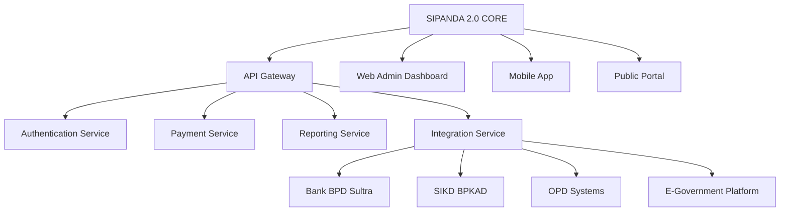

# STUDI KRITIS APLIKASI SIPANDA KOTA BAUBAU

## Analisis Kondisi Existing dan Permasalahan Strategis

### 🚨 **MASALAH UTAMA SIPANDA VERSI 1**

#### **1. FITUR DAN TAMPILAN MINIM**

- **Fitur Terbatas**: Hanya basic payment tanpa integrasi yang komprehensif
- **User Experience Buruk**: Navigasi rumit, loading lambat, desain tidak responsif
- **Fitur Missing**: Tidak ada dashboard analitik, reporting, atau monitoring real-time
- **Mobile Unfriendly**: Tidak optimal untuk perangkat mobile

#### **2. MASALAH AKSES DAN KEPEMILIKAN**

- **Vendor Lock-in**: Akses superadmin dikuasai vendor, pemerintah tidak memiliki kontrol penuh
- **Biaya Tidak Wajar**: Beban biaya layanan administrasi dibebankan ke pemerintah padahal sudah membeli akses
- **Ketergantungan Tinggi**: Setiap perubahan harus melalui vendor dengan biaya tambahan
- **Lack of Transparency**: Pemerintah tidak bisa memonitor performa sistem secara independen

#### **3. FONDASI TEKNIS TIDAK ADA**

- **Arsitektur Rapuh**: Tidak scalable untuk penambahan fitur baru
- **Database Terisolasi**: Tidak terintegrasi dengan sistem OPD lain
- **API Limited**: Tidak mendukung integrasi dengan bank dan sistem eksternal
- **Security Weak**: Keamanan data dan transaksi tidak terjamin

#### **4. MINAT MASYARAKAT RENDAH**

- **Value Proposition Lemah**: Tidak memberikan manfaat jelas bagi pengguna
- **Complex Process**: Proses pembayaran lebih rumit daripada bayar langsung
- **Trust Issues**: Masyarakat tidak percaya dengan sistem digital
- **Awareness Rendah**: Sosialisasi tidak maksimal

#### **5. BACKBONE INFRASTRUKTUR TIDAK JELAS**

- **No Clear Architecture**: Tidak ada blueprint sistem yang komprehensif
- **Integration Gap**: Tidak terhubung dengan SIKD, BPKAD, dan sistem pemerintah
- **Data Silos**: Data terfragmentasi antar OPD
- **Future Proofing**: Tidak ada roadmap pengembangan jangka panjang

---

# PROPOSAL SIPANDA VERSI 2.0

## Solusi Comprehensive dari Perusahaan Kami

### 🎯 **VISI DAN STRATEGI UPGRADE**

#### **Transformasi Digital Menuju Smart Revenue Management**

Kami mengusulkan transformasi total Sipanda menjadi platform **terintegrasi, mandiri, dan berkelanjutan** dengan pendekatan:

```
PHASE 1: Foundation & Ownership Transfer (Bulan 1-3)
PHASE 2: Feature Enhancement & Integration (Bulan 4-6)  
PHASE 3: Analytics & Optimization (Bulan 7-9)
PHASE 4: Expansion & Innovation (Bulan 10-12)
```

### 💡 **SOLUSI FUNDAMENTAL**

#### **1. TRANSFER KEPEMILIKAN DAN KEMANDIRIAN**

- **Full Source Code Handover**: Seluruh kode sumber menjadi milik Pemerintah Kota Baubau
- **Superadmin Ownership**: Akses superadmin sepenuhnya dikelola Bapenda
- **Training & Knowledge Transfer**: Program pelatihan intensif untuk tim IT pemerintah
- **Self-Management Capability**: Pemerintah mampu melakukan maintenance dan pengembangan mandiri

#### **2. ARSITEKTUR TEKNIS YANG KUAT**



### 🚀 **FITUR UTAMA SIPANDA 2.0**

#### **A. SISI MASYARAKAT (USER-CENTRIC DESIGN)**

**1. Unified Dashboard Personal**

- Ringkasan semua kewajiban retribusi dalam satu view
- Personalized recommendation berdasarkan profil pengguna
- Notifikasi smart reminder dengan multiple channel

**2. Simplified Payment Process**

- **One-Click Payment**: Pembayaran multiple retribusi dalam satu transaksi
- **QR Code Integration**: Scan bayar untuk retribusi harian (parkir, pasar)
- **Auto-Debit Scheduling**: Pembayaran otomatis untuk retribusi rutin
- **Multiple Payment Method**: VA Bank BPD, e-wallet, QRIS, kartu kredit

**3. Value-Added Services**

- **E-Certificate**: Sertifikat digital setelah pembayaran
- **Tax Calculator**: Simulasi perhitungan kewajiban
- **Business Analytics**: Laporan konsumsi untuk pelaku usaha
- **Gamification**: Reward system untuk pembayar tepat waktu

#### **B. SISI ADMIN (COMPREHENSIVE MANAGEMENT)**

**1. Centralized Control Center**

- **Super Admin Console**: Kontrol penuh oleh Bapenda
- **Role-Based Access**: Multi-level permission untuk OPD terkait
- **Real-time Monitoring**: Live dashboard semua transaksi
- **Audit Trail**: Log lengkap semua aktivitas sistem

**2. Advanced Analytics & Reporting**

- **Predictive Analytics**: Forecast penerimaan retribusi
- **Compliance Monitoring**: Deteksi potensi tunggakan
- **Performance Dashboard**: KPI masing-masing OPD
- **Custom Report Builder**: Drag-and-drop report generator

**3. Integration Hub**

- **API Management**: Terintegrasi dengan semua OPD terkait
- **Data Synchronization**: Real-time sync dengan BPKAD
- **Bank Gateway**: Integrasi robust dengan Bank BPD Sultra
- **Interoperability**: Connectivity dengan sistem e-government lain

### 💰 **MODEL BIAYA YANG TRANSPARAN**

#### **Breakdown Investasi:**

- **One-Time Development Cost**: Rp 1,2 Miliar (include knowledge transfer)
- **First Year Maintenance**: Rp 180 Juta/tahun (turun 50% dari sistem lama)
- **Training & Capacity Building**: Rp 150 Juta (tim internal pemerintah)
- **Third Party License**: Rp 200 Juta/tahun (bank fees, cloud hosting)

#### **Penghematan yang Dicapai:**

- **Elimination Vendor Fees**: Hemat Rp 400 Juta/tahun biaya vendor lock-in
- **Reduced Operational Cost**: Efisiensi 60% dalam proses administrasi
- **Increased Revenue**: Target kenaikan penerimaan retribusi 25% tahun pertama
- **Cost Avoidance**: Tidak ada biaya tak terduga untuk modifikasi

### 📊 **STRATEGI ADOPSI MASYARAKAT**

#### **Awareness & Engagement Program:**

- **Digital Onboarding**: Pendampingan penggunaan aplikasi
- **Incentive Program**: Cashback dan reward untuk early adopters
- **Community Partnership**: Kolaborasi dengan asosiasi usaha dan komunitas
- **Multi-channel Campaign**: Sosialisasi melalui media tradisional dan digital

#### **User Experience Focus:**

- **Simplified UI/UX**: Desain intuitif untuk semua kalangan
- **Offline Capability**: Bisa input data tanpa koneksi internet
- **Multi-language Support**: Bahasa Indonesia dan lokal
- **Accessibility Features**: Akses untuk difabel dan lansia

### 🔧 **TEKNOLOGI DAN INFRASTRUKTUR**

#### **Tech Stack Modern:**

- **Frontend**: React.js + PWA (Progressive Web App)
- **Backend**: Node.js + Microservices Architecture
- **Database**: PostgreSQL + Redis Cache
- **Mobile**: React Native (iOS & Android)
- **Security**: End-to-end encryption + OAuth 2.0

#### **Infrastructure Robust:**

- **Cloud Hosting**: AWS/GCP dengan auto-scaling
- **Disaster Recovery**: Backup redundant dan recovery plan
- **Performance Monitoring**: 24/7 system health monitoring
- **Security Compliance**: Memenuhi standar keamanan pemerintah

### 📈 **SUCCESS METRICS DAN TARGET**

#### **Key Performance Indicators:**

- **User Adoption**: 70% wajib retribusi aktif menggunakan aplikasi dalam 6 bulan
- **Revenue Growth**: Kenaikan 25% penerimaan retribusi tahun pertama
- **Cost Efficiency**: Pengurangan 60% biaya operasional pemungutan
- **Satisfaction Rate**: Skor kepuasan pengguna minimal 4.5/5.0

#### **Implementation Timeline:**

```
Month 1-2: Assessment & Architecture Design
Month 3-4: Core Development & Integration
Month 5-6: Testing & Training
Month 7: Go-Live & Migration
Month 8-12: Optimization & Enhancement
```

### 🤝 **COMMITMENT KAMI**

#### **Dukungan Pasca Implementasi:**

- **12 Months Warranty**: Perbaikan bug dan issue tanpa biaya tambahan
- **24/7 Technical Support**: Support line dedicated untuk pemerintah
- **Quarterly Review**: Evaluasi berkala dan improvement recommendation
- **Roadmap Development**: Penyusunan blueprint pengembangan jangka panjang

#### **Capacity Building:**

- **Training Program**: Sertifikasi untuk tim IT pemerintah
- **Documentation**: Manual teknis dan operasional lengkap
- **Community Forum**: Platform knowledge sharing antar pemerintah daerah

---

**Kesimpulan**: Sipanda 2.0 bukan sekadar upgrade teknis, tetapi **transformasi fundamental** menuju pengelolaan retribusi yang mandiri, efisien, dan berkelanjutan. Dengan pendekatan ini, Pemerintah Kota Baubau akan memiliki kendali penuh dan mampu meningkatkan penerimaan retribusi secara signifikan.

Kami siap mempresentasikan proposal detail dan demonstrasi prototype dalam waktu 7 hari kerja.
