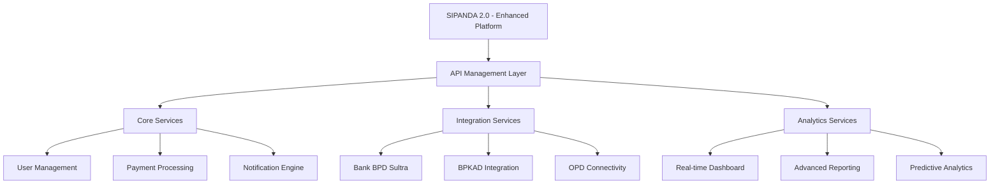

# PROPOSAL PENGEMBANGAN SIPANDA VERSI 2.0

## Evolusi Sistem Management Retribusi Digital Kota Baubau

### 🌟 **APRESIASI TERHADAP PENCAPAIAN AWAL**

Kami menyampaikan penghargaan yang setinggi-tingginya atas inisiatif dan usaha yang telah dilakukan dalam pengembangan Sipanda versi 1.0. Langkah awal ini telah membuka jalan bagi transformasi digital di Kota Baubau dan memberikan fondasi awal yang berharga untuk pengembangan lebih lanjut.

Sebagai sistem generasi pertama, Sipanda 1.0 telah berhasil:

- Memperkenalkan konsep pembayaran retribusi digital di Kota Baubau
- Memberikan pengalaman awal yang valuable bagi semua stakeholder
- Mengidentifikasi kebutuhan dan tantangan riil di lapangan

### 🚀 **VISI PENGEMBANGAN SIPANDA 2.0**

#### **Evolusi Menuju Sistem yang Lebih Komprehensif**

Kami mengusulkan pengembangan Sipanda 2.0 sebagai evolusi natural dari sistem yang ada, dengan pendekatan:

```
FASE 1: Konsolidasi dan Stabilisasi (Bulan 1-3)
FASE 2: Pengayaan Fitur dan Integrasi (Bulan 4-6)
FASE 3: Optimisasi dan Skalabilitas (Bulan 7-9)
FASE 4: Inovasi dan Ekspansi (Bulan 10-12)
```

### 💡 **STRATEGI PENGEMBANGAN BERKELANJUTAN**

#### **1. Penguatan Fondasi Teknis**

Kami mengusulkan arsitektur yang lebih robust untuk mendukung pertumbuhan sistem di masa depan:



#### **2. Peningkatan Kapabilitas Sistem**

Kami berfokus pada pengayaan fitur yang melengkapi sistem existing:

**A. Penyempurnaan Pengalaman Pengguna**

- **Unified Dashboard**: Konsolidasi semua layanan dalam satu tampilan terintegrasi
- **Simplified Navigation**: Penyederhanaan alur penggunaan untuk kenyamanan masyarakat
- **Progressive Enhancement**: Penambahan fitur secara bertahap berdasarkan feedback

**B. Penguatan Sisi Administrasi**

- **Enhanced Management Console**: Dashboard monitoring yang lebih komprehensif
- **Multi-tenant Architecture**: Dukungan untuk manajemen multi-OPD yang lebih smooth
- **Advanced Reporting**: Kemampuan analisis data yang lebih mendalam

### 🤝 **MODEL KOLABORASI YANG SINERGIS**

#### **Pendekatan Knowledge Transfer**

Kami mengusulkan model kemitraan yang mengedepankan keberlanjutan:

- **Co-development Approach**: Tim IT pemerintah terlibat aktif dalam pengembangan
- **Comprehensive Documentation**: Dokumentasi sistem yang lengkap dan mudah dipahami
- **Phased Ownership Transfer**: Penyerahan kepemilikan secara bertahap dan terencana
- **Capacity Building Program**: Pelatihan berkelanjutan untuk tim internal

#### **Model Investasi yang Transparan**

Rincian lengkap mengenai alokasi biaya pengembangan diuraikan dalam dokumen terpisah.

- **Development Cost**: Investasi pengembangan sistem enhanced.
- **Knowledge Transfer Fee**: Biaya pelatihan dan dokumentasi.
- **Maintenance & Support**: Layanan pemeliharaan dengan model yang jelas.
- **Performance-based Pricing**: Bagian dari biaya terkait dengan pencapaian target

*Untuk rincian detail Rencana Anggaran Biaya (RAB), silakan merujuk ke file [**RAB Sipanda v2.0**](./RAB_Sipanda_v2.md).*

### 🎯 **FOKUS PENINGKATAN UTAMA**

#### **1. Optimisasi Kinerja Sistem**

- Peningkatan kecepatan dan responsivitas aplikasi
- Optimisasi database dan query performance
- Enhancement security measures

#### **2. Pengayaan Fitur Bernilai Tambah**

- **Personalized Services**: Layanan yang disesuaikan dengan profil pengguna
- **Business Intelligence**: Tools analisis untuk pengambilan keputusan
- **Omni-channel Experience**: Konsistensi pengalaman across platform

#### **3. Penguatan Ekosistem Digital**

- **API Ecosystem**: Kemampuan integrasi yang lebih luas
- **Third-party Integration**: Konektivitas dengan sistem eksternal
- **Scalability Framework**: Dukungan untuk pertumbuhan masa depan

### 📊 **STRATEGI ADOPSI BERJENJANG**

#### **Community Engagement Plan**

- **User Education Program**: Sosialisasi dan edukasi fitur-fitur baru
- **Feedback Mechanism**: Saluran komunikasi dua arah dengan pengguna
- **Continuous Improvement**: Siklus perbaikan berkelanjutan berdasarkan masukan

#### **Stakeholder Alignment**

- **OPD Collaboration Framework**: Model kerjasama yang jelas dengan OPD terkait
- **Bank Partnership**: Penguatan kemitraan dengan Bank BPD Sultra
- **Community Involvement**: Pelibatan masyarakat dalam pengembangan

### 💰 **MODEL NILAI DAN PENGEMBANGAN**

#### **Value Proposition**

- **Enhanced User Experience**: Pengalaman pengguna yang lebih intuitif
- **Operational Efficiency**: Peningkatan efisiensi operasional
- **Revenue Optimization**: Optimalisasi penerimaan retribusi
- **Sustainable Growth**: Dukungan untuk pertumbuhan berkelanjutan

#### **Roadmap Pengembangan**

```
Bulan 1-3: Foundation & Performance Optimization
Bulan 4-6: Feature Enhancement & Integration
Bulan 7-9: Analytics & Automation
Bulan 10-12: Innovation & Expansion
```

### 🌱 **STRATEGI KEBERLANJUTAN**

#### **Capacity Building**

- **Training & Certification**: Program sertifikasi untuk tim IT pemerintah
- **Best Practices Sharing**: Knowledge sharing across departments
- **Community of Practice**: Forum untuk berbagi pengalaman dan solusi

#### **Sustainable Architecture**

- **Modular Design**: Kemudahan pengembangan dan pemeliharaan
- **Open Standards**: Penggunaan standar terbuka untuk interoperabilitas
- **Future-proofing**: Desain yang mendukung evolusi teknologi

### 📈 **METRIK KEBERHASILAN**

#### **Performance Indicators**

- **System Reliability**: Uptime 99.5% dan response time optimal
- **User Adoption**: Peningkatan utilisasi sistem yang signifikan
- **Stakeholder Satisfaction**: Peningkatan kepuasan pengguna dan OPD
- **Operational Efficiency**: Pengurangan beban administrasi

### 🤝 **PENUTUP**

Kami percaya bahwa pengembangan Sipanda 2.0 merupakan langkah evolusioner yang diperlukan untuk memenuhi kebutuhan yang terus berkembang. Dengan pendekatan kolaboratif dan berfokus pada nilai tambah, kami yakin dapat bersama-sama membangun sistem yang lebih robust, user-friendly, dan sustainable.

Kami mengajak seluruh stakeholder untuk bersama-sama dalam perjalanan transformasi digital ini, dengan semangat kemitraan dan komitmen untuk memberikan yang terbaik bagi Kota Baubau.

**Siap untuk mendiskusikan lebih lanjut dan menyusun rencana implementasi yang detail.**
