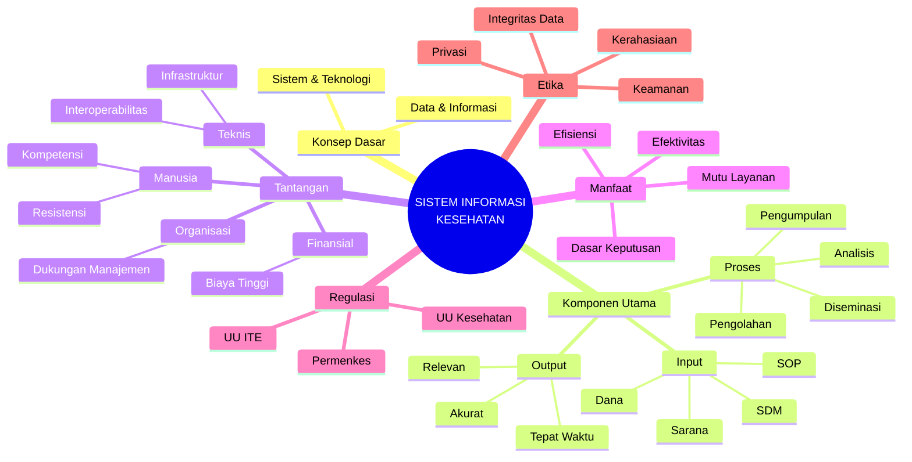

Penjelasan Mindmap: Sistem Informasi Kesehatan (SIMKES)

Dokumen ini menguraikan kerangka kerja Sistem Informasi Kesehatan (SIMKES) berdasarkan mindmap yang tersedia. Struktur ini mencakup konsep dasar, komponen teknis, tantangan, manfaat, hingga aspek hukum dan etika.

---

## 1. Konsep Dasar Sistem Informasi

Bagian ini menjelaskan fondasi teoritis dari sistem informasi.

* **Data dan Informasi:** Memahami transformasi data mentah menjadi informasi yang bermakna, dan akhirnya menjadi pengetahuan (knowledge).
* **Sistem Informasi:** Definisi sistem sebagai kumpulan komponen yang saling berinteraksi untuk mencapai tujuan tertentu.
* **Teknologi Informasi:** Peran perangkat keras (hardware) dan perangkat lunak (software) sebagai enabler.

## 2. Komponen Sistem Informasi Kesehatan

Mengadopsi pendekatan sistem (Input-Proses-Output).

### a. Input (Sumber Daya)

Faktor-faktor yang dibutuhkan agar sistem dapat berjalan:

* **SDM (Sumber Daya Manusia):** Tenaga ahli IT, tenaga kesehatan, dan administrator.
* **Dana/Anggaran:** Pembiayaan untuk infrastruktur dan operasional.
* **Sarana Prasarana:** Komputer, jaringan, server.
* **Kebijakan & SOP:** Aturan main dan prosedur standar operasional.

### b. Proses (Manajemen Data)

Siklus hidup data di dalam sistem:

* **Pengumpulan:** Cara data diambil (sensus, survei, rekam medis).
* **Pengolahan:** Validasi dan kompilasi data.
* **Analisis:** Mengubah data menjadi tren atau statistik.
* **Penyajian & Diseminasi:** Menampilkan data dalam bentuk grafik/laporan untuk pengguna.

### c. Output (Kualitas Informasi)

Syarat informasi yang baik yang dihasilkan sistem:

* **Akurat:** Bebas dari kesalahan.
* **Tepat Waktu:** Tersedia saat dibutuhkan.
* **Relevan:** Sesuai dengan kebutuhan pengguna.
* **Lengkap:** Mencakup seluruh variabel yang diperlukan.

## 3. Tantangan & Hambatan

Kendala yang sering dihadapi dalam implementasi SIMKES di lapangan.

* **Aspek Teknis:** Masalah infrastruktur (listrik/internet), interoperabilitas (sistem tidak saling bicara), dan keamanan siber.
* **Aspek Manusia (SDM):** Resistensi terhadap perubahan (menolak sistem baru), kurangnya literasi digital, dan budaya kerja manual.
* **Aspek Organisasi:** Kurangnya dukungan dari level manajerial/pimpinan, strategi yang tidak matang.
* **Aspek Finansial:** Biaya investasi awal dan perawatan (maintenance) yang tinggi.

## 4. Manfaat SIMKES

Dampak positif yang diharapkan dari penerapan sistem.

* **Bagi Pasien:** Peningkatan mutu layanan, waktu tunggu lebih singkat, keamanan data medis.
* **Bagi Fasyankes (RS/Puskesmas):** Efisiensi operasional, administrasi yang rapi, mencegah *human error*.
* **Bagi Pemerintah:** Dasar pengambilan kebijakan berbasis data (*evidence-based policy*), pemantauan wabah penyakit.

## 5. Regulasi (Dasar Hukum)

Payung hukum yang mengatur penerapan SIMKES di Indonesia.

* **UU ITE:** Mengatur transaksi elektronik dan keamanan siber.
* **UU Kesehatan:** Landasan umum pelayanan kesehatan.
* **Peraturan Menteri Kesehatan (Permenkes):** Petunjuk teknis (Juknis) spesifik seperti Permenkes tentang Rekam Medis Elektronik atau SIMRS.
* **Peraturan Pemerintah (PP):** Turunan undang-undang terkait.

## 6. Etika Penerapan

Prinsip moral dalam mengelola data kesehatan.

* **Privasi (Privacy):** Hak pasien untuk menentukan siapa yang boleh mengetahui data kesehatannya.
* **Kerahasiaan (Confidentiality):** Kewajiban tenaga kesehatan menjaga data agar tidak bocor.
* **Keamanan (Security):** Proteksi teknis terhadap akses ilegal.
* **Integritas:** Menjamin data tidak diubah oleh pihak yang tidak berwenang.

---

## Lampiran: Diagram Mermaid

Berikut adalah kode diagram untuk memvisualisasikan struktur di atas. Kode ini dapat dirender menggunakan plugin Mermaid.

