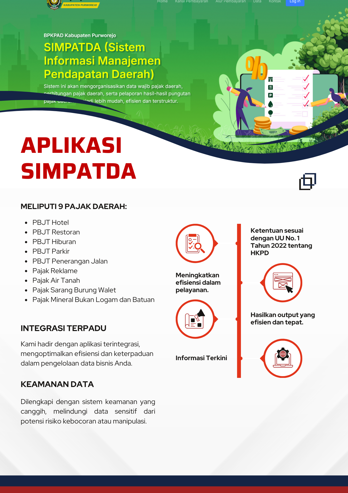

# Perbandingan Opsi Pengembangan Aplikasi Pajak & Retribusi Daerah

Dokumen ini membandingkan dua pendekatan utama untuk penyediaan aplikasi pajak dan retribusi daerah:
1.  **Pengembangan Baru:** Membeli atau membangun aplikasi dari awal.
2.  **Upgrade Eksisting:** Meningkatkan dan memodernisasi aplikasi yang sudah ada (Sipanda).

---

## 1. Opsi Pengembangan Aplikasi Baru (berdasarkan e-katalog)

Opsi ini melibatkan pengadaan aplikasi yang sudah jadi seperti yang ditawarkan di e-katalog.

### Ringkasan Biaya
| Nama Produk | Harga | Catatan |
| --- | --- | --- |
| Aplikasi Pajak dan Retribusi (Raharja Nusantara Sejahtera) | **Rp 180.000.000,00** | Tidak Kena PPN |
| Aplikasi Pajak dan Retribusi (Mahaka Digital Indonesia) | **Rp 185.000.000,00** | Termasuk PPN 12% |

### Contoh Produk di e-katalog

*Gambar 1: Produk dari Raharja Nusantara Sejahtera*

*Gambar 2: Produk dari Mahaka Digital Indonesia*

### Fitur yang Ditawarkan
*   **Platform:** Berbasis Web.
*   **Teknologi:** PHP, PostgreSQL, Apache.
*   **Fungsi Utama:**
    *   Monitoring dan pelaporan Pajak Daerah (e-SPTPD, e-SSPD) secara real-time.
    *   Pengelolaan Retribusi Daerah secara elektronik (Jasa Umum, Jasa Usaha, Perizinan Tertentu).
    *   Integrasi Host-to-Host (H2H) dengan sistem SKPD.
*   **Keamanan & Akses:** Manajemen pengguna, enkripsi password, pencatatan log (logging), dan potensi integrasi Single Sign-On (SSO) dan Tanda Tangan Elektronik (TTE).
*   **Kelemahan:** Sebagai produk jadi, kustomisasi dan penyesuaian dengan proses bisnis spesifik daerah mungkin terbatas dan memerlukan biaya tambahan.

---

## 2. Opsi Upgrade Aplikasi Eksisting (Sipanda v2.0)

Opsi ini fokus pada pengembangan ulang (refactoring) dan penambahan fitur pada aplikasi Sipanda yang sudah dimiliki oleh Pemda.

### Rincian Anggaran Biaya (SSH)
| Kategori Pekerjaan | Alokasi Biaya |
| --- | :---: |
| Refactoring & Penguatan Arsitektur | Rp 26.750.000 |
| Pengembangan Fitur Baru & UI/UX | Rp 20.062.500 |
| Integrasi & Pengujian Lanjutan | Rp 10.031.250 |
| Manajemen & Knowledge Transfer | Rp 10.031.250 |
| **Subtotal** | **Rp 66.875.000** |
| PPN (12%) | Rp 8.025.000 |
| **Total Anggaran** | **Rp 74.900.000** |

### Lingkup Pekerjaan
*   **Refactoring & Penguatan Arsitektur:** Memperbaiki kode dan database untuk meningkatkan performa dan keamanan.
*   **Pengembangan Fitur Baru & UI/UX:** Mendesain ulang antarmuka (UI/UX) agar lebih modern dan menambahkan fungsionalitas baru sesuai kebutuhan.
*   **Integrasi & Pengujian:** Memastikan aplikasi dapat terhubung dengan sistem lain (jika ada) dan bebas dari bug.
*   **Manajemen & Pelatihan:** Termasuk manajemen proyek dan pelatihan bagi pengguna.

---

## Kesimpulan Perbandingan

| Aspek | Opsi 1: Pengembangan Baru | Opsi 2: Upgrade Sipanda |
| --- | --- | --- |
| **Biaya** | **Tinggi** (sekitar Rp 180jt - Rp 185jt) | **Lebih Rendah** (sekitar Rp 75jt) |
| **Kepemilikan** | Lisensi atau produk jadi, source code mungkin tertutup. | **Milik Pemda**, source code terbuka dan dapat dikembangkan lebih lanjut. |
| **Kustomisasi**| Terbatas, tergantung penyedia. | **Sangat Fleksibel**, disesuaikan penuh dengan kebutuhan Pemda. |
| **Waktu** | Relatif cepat jika produk sudah matang. | Membutuhkan waktu pengembangan sesuai lingkup pekerjaan. |

Dengan melakukan upgrade, Pemda dapat menghemat anggaran secara signifikan sambil mendapatkan aplikasi yang sepenuhnya disesuaikan dengan proses bisnis internal dan memiliki kendali penuh atas pengembangan di masa depan.